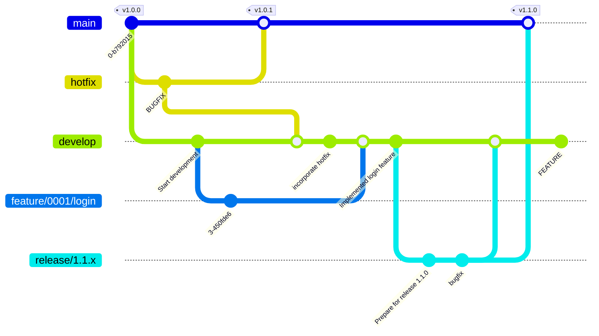

# Branch Strategy

- Adopt a branch strategy based on Git Flow.
- Use release-series branches (e.g., `release/1.1.x`) and `develop` as the main integration branch.
  - Hotfix branches (`hotfix/<issue-number>`) are created for urgent fixes to the production code.
  - Create feature branches (`feature/<issue-number>/<task-description>`) for new features and improvements.
  - Bugfix branches (`bugfix/<issue-number>/<task-description>`) are used for addressing bugs.
  - For medium to large issues, create an integration branch (`issue/<issue-number>`) to
    consolidate changes before merging into `develop`.
- Follow clear naming conventions for branches to enhance collaboration and maintainability.



## 1. Branch Types

### Basic Syntax

```ini
<branch-type>/<issue-number>/<task-description>
```

Some branches, like release or hotfix branches, may not include an Issue number:

```ini
release/<major>.<minor>.<patch>
hotfix/<task-description>
```

### Naming Conventions

| Branch Type       | Naming Convention                                    | Purpose                                          |
| ------------ | --------------------------------------- | ------------------------------------------- |
| **Production**      | `main`                                  | Stable code that can be deployed to production. Always maintains a released state.              |
| **Development**      | `develop`                               | Main integration branch for all features and fixes.                       |
| **Feature**     | `feature/<issue-number>/<task>`               | New feature development or improvement tasks. Small issues can be directly PR'd to develop.         |
| **Enhancement**     | `enhancement/<issue-number>/<task>`           | Existing feature improvement tasks. UX improvements, processing optimizations, etc.                     |
| **Bugfix**     | `bugfix/<issue-number>/<task>`                | Branch for bug fixes. Merged into develop after testing.                   |
| **Issue Integration**  | `issue/<issue-number>`                       | **Only for medium to large issues**. Integration branch to consolidate multiple subtasks. |
| **Release Series**   | `release/<major>.<minor>.x`             | For maintaining stability and minor fixes for a specific minor series (e.g., 1.1.x) (long-lived)        |
| **Release Preparation**   | `beta-release-<version>` | For creating release notes, finalizing versions, and preparing tags (short-lived)                 |
| **Hotfix**     | `hotfix/<issue-number>`                      | Immediate fixes for production. Changes are reflected in both main and develop branches after fixing.        |
| **Testing**   | `test/<issue-number>/<task>`                           | Temporary branches for testing code and validation. Deleted after verification is complete.                  |
| **Documentation** | `docs/<issue-number>/<task>`                           | Branches for updating documentation, guides, README, etc.               |
| **Refactoring** | `refactor/<issue-number>/<task>`                       | Branches for improving internal structure without changing behavior.                     |
| **Sandbox**   | `sandbox/<task>`                        | Experimental branches for trying out new ideas or PoCs (unofficial). Not intended to be merged into stable releases.  |

### Naming Examples

| Branch Name                             | Purpose                |
| --------------------------------- | ----------------- |
| `feature/0123/add-login`             | New feature               |
| `bugfix/0123/fix-login-error`        | Bug fix                |
| `issue/0123`                         | Issue integration       |
| `release/1.1.x`                     | Maintains 1.1 series release     |
| `beta-release-1.1.1` | Prepares 1.1.1 release      |
| `hotfix/0145/critical-fix`           | Hotfix              |

## 2. Development Flow

### Step 1. Subtask Development

Create a branch for each subtask under an Issue:

```bash
git switch develop
git switch -c feature/0123/add-login
git switch -c bugfix/0123/fix-login-error
```

- Small Issues: PR directly to `develop` (Step 3).
- Medium/Large Issues: create an Issue integration branch to consolidate subtasks (Step 2).

### Step 2. Issue Integration Branch (Optional)

Create this branch only if you want to review multiple subtasks together.

```bash
git switch develop
git switch -c issue/0123
git merge feature/0123/add-login
git merge bugfix/0123/fix-login-error
git push -u origin issue/0123
```

- Create a PR: `issue/0123` → `develop`
- Team can review/test multiple subtasks together.

### Step 3. Merge into `develop`

- Create a PR: `issue/0123` → `develop`
- Locally, use `git merge --no-ff`.

### Step 4. Create Release Branch

- Create minor series branch when development stabilizes.
- Use `git switch -c` or GitHub Actions depending on scale:

```bash
git switch develop
git switch -c release/1.1.x
git push -u origin release/1.1.x
```

If you use GitHub Actions, trigger the workflow  `create-release-branch` to create the branch.

### Step 5. Release Prep Branch

```bash
git switch release/1.1.x
git switch -c beta-release-1.1.1
```

Typical tasks are:

- [ ] Update release notes
- [ ] Update version numbers (`__version__.py`, `pyproject.toml`, etc.)
- [ ] Final testing and fixes
- [ ] PR: `beta-release-1.1.1` → `release/1.1.x`, `develop`, `main`
- [ ] Add git tag and merge into `main` branch

## 3. Branch Deletion Policy

| Branch Type                    | Delete Timing                     | Notes                                                |
| ------------------------------ | --------------------------------- | ---------------------------------------------------- |
| `feature` / `bugfix` / `issue` | After merge to `develop`          | Delete immediately; track history via tags if needed |
| `beta-release-<version>`  | After merge to `main` / `develop` | Delete                                               |
| `release/<series>.x`           | Upon next minor series creation   | Keep if still under maintenance                      |

## 4. Guidelines

### Rule 1: Use lowercase letters and hyphens

- Always use lowercase for branch names
- Uppercase letters may cause conflicts on case-sensitive file systems
- Separate words with hyphens (`-`)

**📘 Example**

- ✅ Good: `feature/user-login`
- ❌ Avoid: `Feature_UserLogin`, `FeatUserLogin`

### Rule 2: 明確なトークンからブランチ名を開始する

- 各ブランチ名は、目的を示すカテゴリトークンから始めます。
- トークンの例：
  - `feature`（新機能開発）
  - `bugfix`（バグ修正）
  - `docs`（ドキュメント更新）
- トークンと説明文はスラッシュ（`/`）で区切る

**📘 Example**

- ✅ Example: `bugfix/payment-timeout`
- ❌ Avoid: `payment-timeout` (purpose unclear)

**活用例**

```bash
# Listing branches by token
$ git branch --list "feature/*"

# Pushing or mapping branches with tokens
$ git push origin 'refs/heads/feature/*'

# Deleting multiple branches by token
$ git branch -D $(git branch --list "feature/*")
```

### Rule 3: ブランチ名は簡潔・明確に

- 意図を説明できる範囲で，長すぎる名前は避ける
- 長すぎるブランチ名は，ログ表示の一行に収まらず，可視性が下がるため

**📘 Example**

- ✅ 良い例: `refactor/api-headers`
- ❌ 悪い例: `refactor/update-the-way-we-handle-request-headers-in-api`

### Rule 4: 衝突を生む可能性のあるブランチは作らない

- `git switch -c feature` のように意図が不明瞭な名前や既存ブランチと衝突する可能性のある名前は避ける
- Gitは内部的に ブランチ名をパス（ディレクトリ構造）として管理しているため，`feature` が作成されていると `feature/login-v2` が名前衝突して作成できなくなってしまう
  - 同じ階層にファイルとディレクトリを同時に作れないため

**📘 Example**

```bash
$ git switch -c bugfix/0123/fix-login-error
Switched to a new branch 'bugfix/0123/fix-login-error'

$ ls .git/refs/heads/bugfix/0123
fix-login-error
```
